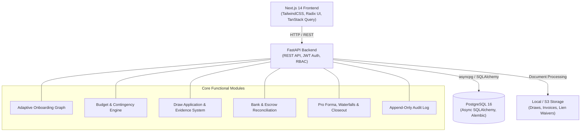

# GroundUp AI

> **Financial Control Center & Construction Intelligence Platform for Real Estate Developers, General Contractors, and Equity Lenders.**

GroundUp AI bridges the trust gap between Developers, General Contractors (GCs), Project Managers (PMs), CFOs, and Equity Investors. It offers automated budget control, adaptive multi-role onboarding, draw package verification, loan payoff tracking, real-time transaction reconciliation, and investor waterfall distribution modeling.

---

## Architecture Overview



### Tech Stack
- **Frontend**: Next.js 14 (App Router), React 18, TypeScript, TailwindCSS, Radix UI primitives, Lucide Icons, Recharts, Vitest & Playwright.
- **Backend**: Python 3.12, FastAPI, Pydantic v2, SQLAlchemy 2.0 (Async), Alembic, Asyncpg, Argon2-cffi, Python-Jose (JWT).
- **Database & Services**: PostgreSQL 16 Alpine via Docker Compose.

---

## Key Modules & Platform Features

1. **Adaptive Multi-Role Onboarding & Decision Graph**
   - Role-customized onboarding paths for `OWNER`, `CFO`, `PM`, `GC`, and `INVESTOR`.
   - Dynamic questionnaire graph adapting questions based on role, responses, and risk criteria.
   - High-risk configuration tracking, duplicate project detection, and missing-information fallback task creation.

2. **Clean B2B SaaS Project Setup (Stage 3 Contract Models)**
   - Contract models supported: **Cost-Plus (Standard)**, **Guaranteed Maximum Price (GMP)**, **Fixed Price (Stipulated Sum)**, **Milestone-Based**, **Open-Book / Target Price**, and **Hybrid / Custom**.
   - Bank Account architecture selection (Dedicated Project Account vs. Shared Operating Account with Virtual Sub-Ledger).

3. **Budget & Contingency Management**
   - Baseline budget locking with audit-logged Change Order Requests (COR).
   - Real-time contingency pool reallocation and overrun monitoring.

4. **Applications for Payment & Draw Management**
   - Submissions by General Contractors with supporting cost evidence, invoices, and unconditional lien waivers.
   - Owner/CFO draw approval workflows with lender draw request packaging and shortfall tracking.

5. **Reconciliation & Anomaly Detection**
   - Bank/Escrow statement import and multi-factor transaction matching.
   - Quarantine resolution for missing invoices, suspicious payees, and unallocated transactions.

6. **Economics, Pro Forma & Investor Waterfall**
   - Equity contributions, unit disposition tracking, loan payoff, and distribution waterfall calculations.
   - Redacted investor portal views and exportable monthly snapshot packages.

---

## Getting Started

### Prerequisites
- **Docker & Docker Compose** (for PostgreSQL)
- **Node.js 18+ & npm** (for Frontend)
- **Python 3.12+** (for Backend)
- **Make** (optional, recommended for convenient CLI targets)

---

### Step-by-Step Complete Setup

#### 1. Clone the Repository
```bash
git clone -b dev https://github.com/prathamempower/groundup_prototype.git
cd groundup_prototype
```

#### 2. Start PostgreSQL Database
```bash
# Using Make
make db-up

# Or using Docker Compose directly
docker compose up -d db
```
*PostgreSQL is exposed on localhost port `5436` (User: `groundup`, Password: `groundup_password`, Database: `groundup_db`).*

#### 3. Backend Setup
Create a Python virtual environment and install the required dependencies:
```bash
cd backend
python3 -m venv .venv
source .venv/bin/activate
pip install -r requirements.txt
cd ..
```

Run Alembic database migrations:
```bash
# Using Make
make migrate

# Or manually
cd backend
PYTHONPATH=. ../backend/.venv/bin/alembic upgrade head
cd ..
```

Seed initial fixtures and demo projects:
```bash
# Using Make
make seed

# Or manually
PYTHONPATH=backend backend/.venv/bin/python -m app.seed.seed_runner
```

#### 4. Frontend Setup
Install frontend dependencies:
```bash
cd frontend
npm install
cd ..
```

---

## Running the Development Servers

You can run both backend and frontend concurrently, or start each service in separate terminals.

### Option A: Run Both Services Concurrently
From the root directory:
```bash
npm run dev
```

### Option B: Run Services Individually
- **Backend API Server (Port 8000)**:
  ```bash
  make dev
  # Or:
  source backend/.venv/bin/activate
  uvicorn app.main:app --reload --host 0.0.0.0 --port 8000 --app-dir backend
  ```
  API Documentation (Swagger UI) is available at: [http://localhost:8000/docs](http://localhost:8000/docs)

- **Frontend App (Port 3000)**:
  ```bash
  cd frontend
  npm run dev
  ```
  Application UI is available at: [http://localhost:3000](http://localhost:3000)

---

## Demo Credentials & Seed Data

All seed accounts belong to the organization **Vance Development LLC**.

Default Password for all seed accounts:
```text
Password123!
```

| Role | User Name | Email Address | Description / Project Scope |
| :--- | :--- | :--- | :--- |
| **Owner** | Marcus Vance | `m.vance@vancedev.com` | Account executive with full budget, draw, and project creation authority |
| **CFO** | Sarah Lin | `s.lin@vancedev.com` | Financial officer overseeing budgets, draws, escrow recons, and waterwalls |
| **PM** | David Ross | `d.ross@vancedev.com` | Project Manager tracking milestones, jobsite verification, and GC progress |
| **GC** | Frank Miller | `frank@apexconstruction.com` | General Contractor submitting draw applications, line items, and lien waivers |
| **Investor** | Elena Rostova | `e.rostova@meridiancap.com` | Equity partner viewing pro formas, investment returns, and distribution notices |

### Pre-configured Seed Projects
1. **73 Broadway (Active Construction / Cost-Plus)**
   - Baseline budget with change orders and contingency reallocations.
   - Commercial checking and escrow accounts with 150+ transactions.
   - Active draw cycle (Draw #1 funded, Draw #3 submitted with $50k lender shortfall).
   - Anomaly alerts: missing invoice voucher #5050 and milestone delay risk.

2. **392 First Street (Completed / Disposition Closed)**
   - 15 closed draw applications fully funded through construction loan.
   - 12 condominium units sold with settlement statements imported.
   - Loan full payoff recorded, investor distributions executed, and closeout audited.

3. **161 Woodlawn Ave (Pre-construction)**
   - Blank canvas project initialized for adaptive onboarding and setup validation.

---

## Testing & Quality Assurance

### Backend Tests
```bash
# Run pytest test suite
make test

# Or directly:
PYTHONPATH=backend backend/.venv/bin/pytest backend/tests -v
```

### Frontend Tests & Type Checking
```bash
cd frontend

# Run unit & component tests (Vitest)
npm run test

# Run TypeScript typecheck
npm run type-check

# Run ESLint
npm run lint

# Run End-to-End browser tests (Playwright)
npm run test:e2e
```

---

## Project Structure

```text
groundup-ai/
├── Makefile                 # Top-level commands for dev, migrations, testing, and seed
├── docker-compose.yml       # PostgreSQL 16 service definition
├── package.json             # Root monorepo script runner
├── docs/                    # Architectural documents, schema designs, and prompt specs
├── backend/
│   ├── alembic.ini          # Database migration configuration
│   ├── pyproject.toml       # Linter, formatter, and typecheck configuration
│   ├── requirements.txt     # Python backend dependencies
│   ├── migrations/          # Alembic version migrations
│   ├── tests/               # Pytest integration and unit test suite
│   └── app/
│       ├── main.py          # FastAPI application entrypoint & middleware
│       ├── config.py        # Pydantic environment configuration
│       ├── database.py      # Async SQLAlchemy session management
│       ├── seed/            # Comprehensive multi-role database seed fixtures
│       └── modules/
│           ├── identity/    # Auth, users, organizations, RBAC policies
│           ├── onboarding/  # Adaptive question graph & role-based onboarding
│           ├── projects/    # Project entities, GC contracts, bank structure
│           ├── budgets/     # Budgets, line items, CORs, contingency movements
│           ├── draws/       # Draw applications, payments, lender shortfalls
│           ├── spend/       # Transactions, invoices, escrow accounts, reconciliations
│           ├── progress/    # Milestones, field verifications, schedule tracking
│           ├── economics/   # Pro formas, units, waterfalls, closeout
│           ├── reporting/   # Investor snapshot packages & exports
│           └── audit/       # Immutable audit logs & event streams
└── frontend/
    ├── app/                 # Next.js 14 App Router pages & layouts
    │   ├── auth/            # Login and authentication views
    │   ├── onboarding/      # 2-column adaptive onboarding flow
    │   ├── projects/new/    # Clean B2B SaaS Stage 3 project bootstrap
    │   ├── budget/          # Budget matrix, contingency reallocation, CORs
    │   ├── draws/           # Draw application workbench & review
    │   ├── reconciliation/  # Bank statement matching & quarantine manager
    │   ├── economics/       # Investor waterfalls & closeout checklist
    │   ├── timeline/        # Milestones and physical verification
    │   ├── submissions/     # Contractor portal for claims and invoices
    │   └── investor-update/ # Stakeholder transparency portal
    ├── components/          # Reusable UI & domain-specific widgets
    ├── lib/                 # API client adapters, types, formatters, routes
    └── tests/               # Vitest unit tests and Playwright E2E tests
```

---

## License

Internal proprietary software developed for GroundUp AI. All rights reserved.
