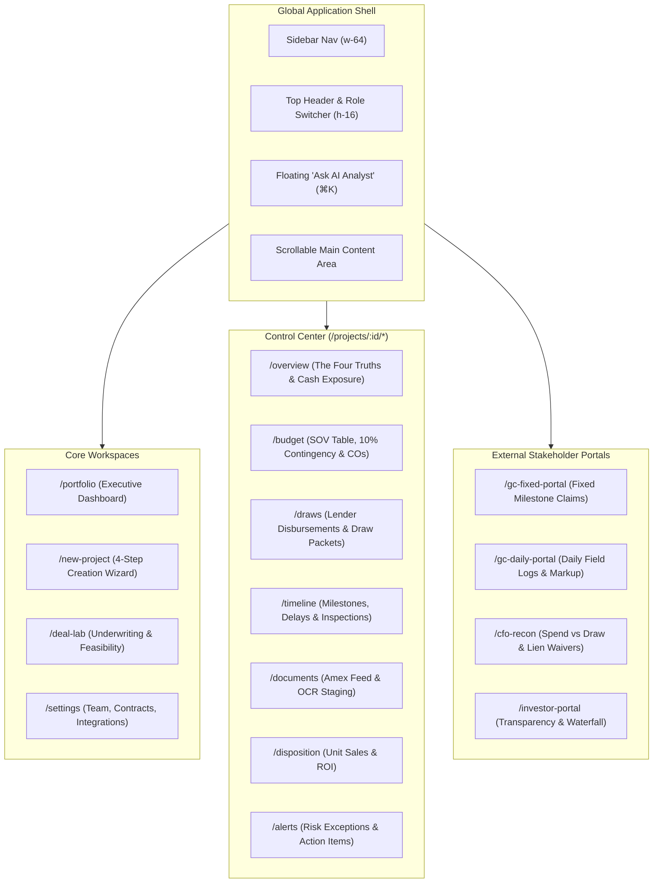

# GroundUp AI — Full Website Screen Audit & Codebase Architecture Map

> **Audit Date:** October 2026  
> **Codebase:** GroundUp AI Prototype (`/src/client`, `/src/server`, `/src/shared`)  
> **Target Audience:** Senior Product Managers, Lead UX/UI Engineers, Solutions Architects  
> **Purpose:** Exhaustive, as-implemented screen-by-screen, component-by-component, workflow, and RBAC security audit prior to any redesign.

---

## 1. Global Application Layout & Shell Architecture

### 1.1 Shell Hierarchy & Top-Level State
- **Root Shell File:** [`src/client/App.tsx`](file:///home/pratham/Projects/GroundUp%20AI/prototype/src/client/App.tsx)
- **Top-Level State Container:** [`src/client/app/use-app-state.ts`](file:///home/pratham/Projects/GroundUp%20AI/prototype/src/client/app/use-app-state.ts)
- **Navigation Router:** [`src/client/app/AppRoutes.tsx`](file:///home/pratham/Projects/GroundUp%20AI/prototype/src/client/app/AppRoutes.tsx) & [`src/client/app/PortalRoutes.tsx`](file:///home/pratham/Projects/GroundUp%20AI/prototype/src/client/app/PortalRoutes.tsx)
- **Global Layout Wrapper:**
  - Standard App Shell consists of:
    1. **Fixed Left Sidebar (`Sidebar.tsx`)**: 64 Tailwind width (`w-64`), full height, border right.
    2. **Main Content Container (`flex-1 flex flex-col h-screen`)**:
       - Sticky Top Header (`TopHeader.tsx`): 16 Tailwind height (`h-16`).
       - Scrollable Main Body (`main.flex-1.overflow-y-auto`): Renders either the active route screen or the [`AccessDeniedScreen.tsx`](file:///home/pratham/Projects/GroundUp%20AI/prototype/src/client/components/AccessDeniedScreen.tsx) if permissions fail.
    3. **Floating Action Trigger**: Fixed bottom-right pill button (`bottom-6 right-6 z-30`) labeled **"Ask AI Analyst"** with Sparkles icon.
    4. **Global Flyout Drawers**:
       - [`AIChatDrawer.tsx`](file:///home/pratham/Projects/GroundUp%20AI/prototype/src/client/components/AIChatDrawer.tsx)
       - [`ProvenanceDrawer.tsx`](file:///home/pratham/Projects/GroundUp%20AI/prototype/src/client/components/ProvenanceDrawer.tsx)

---

### 1.2 Sidebar Navigation (`Sidebar.tsx`)
- **Component File:** [`src/client/components/Sidebar.tsx`](file:///home/pratham/Projects/GroundUp%20AI/prototype/src/client/components/Sidebar.tsx)
- **Subcomponents:**
  - [`SidebarHeader.tsx`](file:///home/pratham/Projects/GroundUp%20AI/prototype/src/client/components/sidebar/SidebarHeader.tsx): Brand mark ("GroundUp AI" with emerald badge "PROD v2.0").
  - [`SidebarNavGroup.tsx`](file:///home/pratham/Projects/GroundUp%20AI/prototype/src/client/components/sidebar/SidebarNavGroup.tsx): Reusable category list section with title and items.
  - [`SidebarProjectList.tsx`](file:///home/pratham/Projects/GroundUp%20AI/prototype/src/client/components/sidebar/SidebarProjectList.tsx): Quick project switcher list with "+ Add Project" action.
  - [`SidebarFooter.tsx`](file:///home/pratham/Projects/GroundUp%20AI/prototype/src/client/components/sidebar/SidebarFooter.tsx): Current user builder avatar/name (`Hardik Parikh`), company name (`GroundUp Development Partners`), role security badge, and sign-out icon button.
- **Navigation Groups & Elements:**
  1. **Core Workspaces:**
     - **Portfolio** (`LayoutGrid` icon) → `/portfolio`
     - **Control Center** (`Building2` icon) → `/projects/:projectId/overview`
     - **Deal Lab** (`Sparkles` icon) → `/deal-lab`
  2. **Project Modules (Contextual to Selected Project):**
     - **Budget & Contingency** (`DollarSign` icon) → `/projects/:projectId/budget`
     - **Draw Lab** (`FileCheck` icon) → `/projects/:projectId/draws` (Includes badge with pending draw count, e.g. `1`)
     - **Milestones & Delay** (`Clock` icon) → `/projects/:projectId/timeline`
     - **Document Inbox** (`FolderOpen` icon) → `/projects/:projectId/documents`
     - **Unit Sales & ROI** (`Home` icon) → `/projects/:projectId/disposition`
     - **Risk Alerts** (`BellRing` icon) → `/projects/:projectId/alerts` (Includes badge with alert count, e.g. `3`)
  3. **External Portals:**
     - **GC Fixed Claims** (`Hammer` icon) → `/gc-fixed-portal`
     - **GC Daily Logs** (`ClipboardList` icon) → `/gc-daily-portal`
     - **CFO & Lien Audit** (`Scale` icon) → `/cfo-recon`
     - **Investor Transparency** (`TrendingUp` icon) → `/investor-portal`
  4. **Admin Section:**
     - **Settings & Team** (`Settings` icon) → `/settings`
  5. **Active Projects List:**
     - Lists all projects from state with status dots (`ACTIVE` = emerald, `ON_HOLD` = amber, `COMPLETED` = blue).
     - "+ Add Project" button (visible only if user has `project:create` permission).

---

### 1.3 Top Header (`TopHeader.tsx`)
- **Component File:** [`src/client/components/TopHeader.tsx`](file:///home/pratham/Projects/GroundUp%20AI/prototype/src/client/components/TopHeader.tsx)
- **Subcomponents:**
  - [`ProjectSelectorDropdown.tsx`](file:///home/pratham/Projects/GroundUp%20AI/prototype/src/client/components/header/ProjectSelectorDropdown.tsx): Dropdown to switch active project globally across all project-scoped views.
  - [`RoleSwitcherDropdown.tsx`](file:///home/pratham/Projects/GroundUp%20AI/prototype/src/client/components/header/RoleSwitcherDropdown.tsx): Instant persona/role switcher dropdown with 8 supported roles.
- **Header Elements & Actions:**
  - **Left Section:**
    - Project selector dropdown menu.
    - Contract model badge tag (e.g. `Fixed-Price Contract` or `Daily Updates T&M`).
  - **Right Section:**
    - **Ask AI Analyst button**: Icon + label + shortcut indicator (`⌘K`), opens `AIChatDrawer`.
    - **+ Change Order button**: Quick action (gated to roles with `change_order:create`). Navigates to budget and opens `ChangeOrderModal`.
    - **+ Draw Packet button**: Quick action (gated to roles with `draw:create_packet`). Navigates to draws and opens `DrawPacketModal`.
    - **Role Switcher Dropdown**: Allows rapid testing across all roles.

---

### 1.4 Global Drawers & Modals

#### 1.4.1 AI Chat Drawer (`AIChatDrawer.tsx`)
- **File:** [`src/client/components/AIChatDrawer.tsx`](file:///home/pratham/Projects/GroundUp%20AI/prototype/src/client/components/AIChatDrawer.tsx)
- **Trigger:** Floating bottom-right button or Top Header "Ask AI Analyst" button or `⌘K`.
- **Layout:** Right-hand side slide-out sheet (`max-w-md bg-white h-full shadow-2xl`).
- **Elements:**
  - Header: Sparkles badge, "AI Financial Analyst", Project Name, Close (X) button.
  - Quick Suggestion Pills:
    - `"What is my current cash exposure?"`
    - `"Which budget lines are over budget?"`
    - `"How much delay cost have I accumulated?"`
  - Message Stream: Conversation history (User vs Assistant) with typing bounce animation.
  - Input Footer: Text input with placeholder `"Ask about budget, draws, timeline..."` and Send button. Notice: `"AI answers are traced to confirmed ledger data only"`.
- **Mock Response Logic:** Contains keyword matching logic for `cash`, `budget`, `delay`, `profit`, `draw` that quotes actual ledger figures.

#### 1.4.2 Provenance Drill-Down Drawer (`ProvenanceDrawer.tsx`)
- **File:** [`src/client/components/ProvenanceDrawer.tsx`](file:///home/pratham/Projects/GroundUp%20AI/prototype/src/client/components/ProvenanceDrawer.tsx)
- **Trigger:** Clicking any of the **Four Truths** cards on Overview tab, clicking "Audit Lineage" on Hero Metric card, or clicking individual line items in Budget table.
- **Layout:** Right-hand side slide-out sheet (`max-w-lg bg-white h-full shadow-2xl`).
- **Elements:**
  - Header: Shield icon, "PROVENANCE AUDIT", Metric Title (e.g. `Spend Truth — All Categories`), total figure ($1,412,400).
  - Formula Box: Exact mathematical formula applied (e.g. `DeveloperCashExposure = TotalActualSpend ($1,412,400) − AmountFunded ($1,094,000)`).
  - Source Records Node List:
    - Status Badge: `✓ Confirmed`, `Auto-posted`, or `⚠️ Pending Review`.
    - Confidence score badge (e.g. `98%`, `61%`).
    - Amount + Node Label (e.g. `Electrical — ABC Electric LLC`).
    - Source file and page reference (e.g. `Electrical_Invoice_Sep.pdf · Page 1, Row 1`).
    - Date and entering entity/actor (e.g. `Sep 28, 2026 · CFO Review`).
    - "View Source Document" button.
  - Footer Disclaimer: *"Every figure on this platform is traceable to its source document. AI proposes, deterministic code calculates."*

---

## 2. Exhaustive Route & Page Audit

---

### Route 1: Authentication Screen (`/` unauthenticated)
- **Component:** [`src/client/screens/AuthScreen.tsx`](file:///home/pratham/Projects/GroundUp%20AI/prototype/src/client/screens/AuthScreen.tsx)
- **Route:** Rendered when `currentUser === null`.
- **Purpose:** Gateway for user login, signup, Google OAuth mock, and 1-click persona switching for testing.
- **Access:** Public / Unauthenticated.
- **Layout:** Two-column split layout (Desktop: 50/50 left hero banner, right authentication form).
- **Major Components:**
  1. **Left Hero (`AuthHero.tsx`)**:
     - Dark background with gradient accents.
     - Brand mark: GroundUp AI.
     - Value proposition: "Autonomous Real Estate Construction Finance & Underwriting".
     - Feature checkmarks: Real-time budget vs spend tracking, automated draw packet generation, zero-hallucination mathematical verification.
  2. **Right Auth Panel (`AuthForm.tsx`, `GoogleAuthButton.tsx`, `DirectLoginGrid.tsx`)**:
     - Tab switch: "Sign In" vs "Create Account".
     - Form Fields (Sign In): Email Address, Password, "Sign In" submit button.
     - Form Fields (Sign Up): Full Name, Company Name, Email Address, Password, "Create Account" submit button.
     - Google OAuth button ("Continue with Google").
     - **Direct Demo Login Personas Grid** (8 persona cards):
       1. **Developer / Owner** (`Hardik Parikh` - GroundUp Dev Partners)
       2. **Finance / CFO** (`Sarah Jenkins` - GroundUp Finance)
       3. **Project Manager** (`Marcus Vance` - On-Site Operations)
       4. **General Contractor (Fixed)** (`Dave Kowalski` - Kowalski Builders LLC)
       5. **General Contractor (Daily)** (`Frank Miller` - Miller Framing & Carpentry)
       6. **Construction Lender** (`Elena Rostova` - Horizon Capital Bank)
       7. **Accountant / Controller** (`Rachel Green` - Ledger & Balance LLC)
       8. **Equity Investor** (`David Chen` - Apex Real Estate Fund)
- **States:** Loading state with spinners on button click; direct login immediately logs in and routes to the role's default workspace.

---

### Route 2: New User Intake & Onboarding Flow
- **Component:** [`src/client/screens/NewUserIntakePage.tsx`](file:///home/pratham/Projects/GroundUp%20AI/prototype/src/client/screens/NewUserIntakePage.tsx) → [`src/client/onboarding/OnboardingFlow.tsx`](file:///home/pratham/Projects/GroundUp%20AI/prototype/src/client/onboarding/OnboardingFlow.tsx)
- **Route:** Intercepted at root when `currentUser.isNewUser === true`.
- **Purpose:** Context-aware, dynamic, sequential 1-question-at-a-time onboarding questionnaire that builds the user workspace, sets up default projects, and determines initial target screen.
- **Access:** Any authenticated user flagged with `isNewUser: true`.
- **Layout:** Centered single-card stepper with progress bar and header reset/sign-out buttons.
- **Question Graph Structure (`src/client/onboarding/questions/`):**
  - **Step 1 (Root):** Role Selection (`OWNER`, `ADMIN`, `PROJECT_MANAGER`, `GENERAL_CONTRACTOR`, `FINANCE`, `ACCOUNTANT`, `INVESTOR`, `VIEWER`).
  - **Branching Sequences:**
    - *Owner Path:* Mode selection (Demo project vs New Project) → Project details (Name, Address, Type, Strategy, Budget) → Contract Model (Fixed Price vs Cost-Plus/Daily) → Target Completion.
    - *PM Path:* Active site focus (Inspections & Milestone signoffs vs Daily logs & Sub management).
    - *GC Path:* Contract billing model (`LUMP_SUM_FIXED` vs `DAILY_UPDATES_TM`).
    - *Finance/CFO Path:* Accounting priority (Draw Packet compilation vs Amex reconciliation vs Lien waiver audit).
    - *Accountant Path:* Ledger focus (AP/Invoices vs Draw reconciliation).
    - *Investor/Viewer Path:* Transparency scope (Executive summaries vs Condo sales waterfall).
  - **Review Step (`OnboardingReviewStep.tsx`):**
    - Summarizes all answered parameters.
    - Displays resolved workspace destination and generated setup tasks.
    - "Launch My Workspace" CTA button (stores project in memory and enters main shell).

---

### Route 3: Portfolio Overview Screen (`/portfolio`)
- **Component:** [`src/client/screens/PortfolioScreen.tsx`](file:///home/pratham/Projects/GroundUp%20AI/prototype/src/client/screens/PortfolioScreen.tsx)
- **Route:** `/portfolio`
- **Purpose:** High-level executive dashboard showing all development projects, cross-portfolio aggregate financials, and risk items.
- **Access:** `OWNER`, `ADMIN`, `FINANCE`, `PROJECT_MANAGER`, `DEVELOPER_OWNER`, `CFO`. (Gated via `isScreenPermitted(role, 'portfolio')`).
- **Layout:** 7xl max-width centered container (`max-w-7xl mx-auto px-8 py-8`).
- **Major Components:**
  1. **Portfolio Header (`PortfolioHeader.tsx`)**:
     - Status dot + "Executive Portfolio Overview".
     - Personalized greeting: "Good morning, Hardik. 👋".
     - Date + Active Project Count + Attention Badge ("2 items need attention").
     - Action Buttons: "Deal Underwriting" (opens Deal Lab) and "+ New Project" (opens New Project wizard).
  2. **Portfolio KPI Summary Tiles (`PortfolioKPITiles.tsx`)**:
     - *Total Portfolio Budget:* e.g. `$5,670,000` (Across 4 properties).
     - *Total Capital Spent:* e.g. `$2,878,400` (51% of aggregate budget).
     - *Total Bank Funded:* e.g. `$2,144,000` (Confirmed disbursements).
     - *Net Developer Exposure:* e.g. `$734,400` (Fronted equity awaiting draw reimbursement).
  3. **Portfolio Alert Banner (`PortfolioAlertBanner.tsx`)**:
     - Amber banner showing active unsubmitted draw packets (e.g. "Draw #3 for 73 Broadway ($185,000) ready for review").
     - Action button: "Open Draw Lab →".
  4. **Portfolio Filters & Search Bar (`PortfolioFilters.tsx`)**:
     - Search input (filters by project name, address, GC, or lender).
     - Filter tabs: `All (4)`, `Active (3)`, `Completed (1)`.
  5. **Portfolio Project Cards List (`PortfolioProjectList.tsx` & `ProjectCardItem.tsx`)**:
     - Renders rich project cards.
     - *Active Card:* Shows Status badge, alerts badge, GC name, Lender name, progress bar, financial stats strip (Budget, Spent, Funded, Exposure), and "View Project →" button.
     - *Completed Card:* Shows blue badge, Final Disposition revenue, Total Cost, Net Developer Profit (+$387,000), Realized ROI (15.2%), and "View Project →" button.
  6. **Portfolio Footer Quick Links (`PortfolioFooterLinks.tsx`)**:
     - Navigation shortcuts to Deal Lab, Draw Lab, and specific active projects.

---

### Route 4: New Project Creation Wizard (`/new-project`)
- **Component:** [`src/client/screens/new-project/NewProjectScreen.tsx`](file:///home/pratham/Projects/GroundUp%20AI/prototype/src/client/screens/new-project/NewProjectScreen.tsx)
- **Route:** `/new-project`
- **Purpose:** Multi-step wizard to initialize a new construction or development project entity.
- **Access:** Users with `project:create` permission (`OWNER`, `ADMIN`, `DEVELOPER_OWNER`).
- **Layout:** Header + Left step sidebar (`NewProjectSidebar.tsx`) + Right step content card + Sticky bottom action bar (`NewProjectActionBar.tsx`).
- **Wizard Steps:**
  1. **Foundation (`FoundationStep.tsx`):**
     - Fields: Project Name (`text`), Property Address (`text`), Project Type (`select`: Ground-up, Value-add, Renovation, Adaptive Reuse), Strategy (`select`: Build to Rent, Build to Sell, Hold, Fix and Flip).
  2. **Current Status (`StatusStep.tsx`):**
     - Fields: Project Entity / Owner (`text`), Current Stage (`select`: Pre-development, Permitting, Pre-construction, Active Construction), Acquisition Status (3 toggle buttons: `Acquired`, `Under Contract`, `Evaluating`).
  3. **Financials & Schedule (`FinancialsStep.tsx`):**
     - Conditional Fields (if Acquired/Under Contract): Acquisition Date (`date`), Acquisition Cost (`number`).
     - Global Fields: Total Project Cost / Target Budget (`number`), Target Completion Date (`date`), Funding Method (`select`: Cash, Debt/Loan, Combined), Project Manager Name (`text`).
  4. **Review & Confirm (`ReviewStep.tsx`):**
     - Read-only review grid showing all configured parameters with "Ready to Create" badge.
- **Action Bar:** "Back", "Cancel", "Continue →", and "Create Project" submission buttons. Submits to local storage / project state.

---

### Route 5: Project Detail & Control Center (`/projects/:projectId` and tabs)
- **Component:** [`src/client/screens/ProjectDetailScreen.tsx`](file:///home/pratham/Projects/GroundUp%20AI/prototype/src/client/screens/ProjectDetailScreen.tsx) (wrapped by [`ProjectDetailRouteWrapper.tsx`](file:///home/pratham/Projects/GroundUp%20AI/prototype/src/client/app/ProjectDetailRouteWrapper.tsx))
- **Route:** `/projects/:projectId/:tab` (where `:tab` is `overview`, `budget`, `draws`, `timeline`, `documents`, `disposition`, `alerts`).
- **Purpose:** Primary operating workspace for an individual construction development project.
- **Layout:** Sticky top project sub-header (`ProjectDetailHeader.tsx`), tab navigation bar (`ProjectDetailNav.tsx`), dynamic tab content area (`ProjectDetailTabContent.tsx`), and project modals container (`ProjectDetailModals.tsx`).
- **Header Elements (`ProjectDetailHeader.tsx`):**
  - "← Back to Portfolio" link.
  - Project Title (e.g. `73 Broadway, Hoboken`).
  - Role-specific contextual action buttons:
    - *GC Fixed:* "+ Submit Milestone Claim"
    - *GC Daily:* "+ Post Daily Log"
    - *Owner/Finance:* "+ Change Order", "+ Draw Packet"
- **Tab Navigation Bar (`ProjectDetailNav.tsx`):**
  - Displays only tabs permitted for current user role (filtered via `isTabPermitted(role, tab)`).
  - Badges on Draws (pending count) and Alerts (unresolved count).

#### 5.1 Sub-Tab: Overview (`/projects/:projectId/overview`)
- **Component:** [`src/client/screens/project-detail/tabs/OverviewTab.tsx`](file:///home/pratham/Projects/GroundUp%20AI/prototype/src/client/screens/project-detail/tabs/OverviewTab.tsx)
- **Elements:**
  1. **The Four Domain Truths (Deterministic · Zero Hallucination):**
     - 4 interactive KPI cards with provenance drill-down triggers:
       - *1. Budget Truth:* e.g. `$1,820,000` (Baseline + Approved COs)
       - *2. Spend Truth:* e.g. `$1,412,400` (78% of Budget Posted)
       - *3. Funding Truth:* e.g. `$1,094,000` (Disbursed by BCB Bank only)
       - *4. Progress Truth:* e.g. `72% Verified` (Inspection Sign-Offs, Non-Inferred)
  2. **Hero Metric: Developer Cash Exposure Card:**
     - High-contrast slate card showing `$318,400`.
     - Formula breakdown: `Actual Spend ($1,412,400) − Lender Disbursed ($1,094,000)`.
     - Explanatory copy and "Audit Lineage →" button triggering `ProvenanceDrawer`.
  3. **Project Economics Card (`ProjectEconomicsCard.tsx`):**
     - Comparison table: Initial Pro Forma vs Current Forecast (Hard Costs, Soft Costs, Acquisition, Financing, Total Cost, Revenue, Gross Margin, Net ROI).
  4. **Loan Facility Card (`LoanFacilityCard.tsx`):**
     - Bank Name (`BCB Community Bank`), Facility Limit (`$1,450,000`), Interest Rate (`9.75% Floating Prime+1.25%`), Daily Carrying Cost (`$324/day`), Interest Reserve meter bar ($84,000 of $120,000 utilized).

#### 5.2 Sub-Tab: Budget & Contingency (`/projects/:projectId/budget`)
- **Component:** [`src/client/screens/project-detail/tabs/BudgetTab.tsx`](file:///home/pratham/Projects/GroundUp%20AI/prototype/src/client/screens/project-detail/tabs/BudgetTab.tsx)
- **Elements:**
  1. **Contingency Reserve Banner:**
     - Displays 10% Reserve balance remaining (e.g. `$42,000 remaining` of `$82,000`).
     - Actions: "Absorb Overrun from Contingency" (opens `ContingencyModal`) and "New Change Order" (opens `ChangeOrderModal`).
  2. **Schedule of Values (SOV) Budget Table (`BudgetSovTable.tsx`):**
     - Columns: Cost Category, Approved Budget, Actual Spend Posted, Variance ($ / %), Progress Verified %, Contingency Absorbed, Actions (Audit Lineage, Absorb Overrun).
     - Highlights line-item overruns in red (e.g. Site Work +$4,000 over budget).
  3. **Change Orders Section (`ChangeOrdersSection.tsx` & `ChangeOrdersList.tsx`):**
     - Table listing all approved and pending Change Orders (CO Number, Category, Amount, Reason, GC Visibility status, Approval status).
     - **Inline Change Order Form (`InlineChangeOrderForm.tsx`)**: Expandable in-page form for quick change order entry without modal popup.

#### 5.3 Sub-Tab: Draw Lab (`/projects/:projectId/draws`)
- **Component:** [`src/client/screens/project-detail/tabs/DrawsTab.tsx`](file:///home/pratham/Projects/GroundUp%20AI/prototype/src/client/screens/project-detail/tabs/DrawsTab.tsx)
- **Elements:**
  1. **Header & Action:** Title, subtitle, "+ Build Draw #N Packet" button (opens `DrawPacketModal`).
  2. **Draw Cards Feed:**
     - Cards for Draw #1 (Disbursed $605,000), Draw #2 (Disbursed $489,000), Draw #3 (Pending Review $185,000).
     - Breakdown table per draw: Category, Requested Amount, Status (`✓ Disbursed` vs `⏳ Pending Review`).
     - Attached Lender Memo text and revision indicators.

#### 5.4 Sub-Tab: Milestones & Delay (`/projects/:projectId/timeline`)
- **Component:** [`src/client/screens/project-detail/tabs/TimelineTab.tsx`](file:///home/pratham/Projects/GroundUp%20AI/prototype/src/client/screens/project-detail/tabs/TimelineTab.tsx)
- **Elements:**
  1. **Cumulative Delay Banner:** e.g. `Cumulative Delay: 82 Days (+$26,568 Carry Cost)`.
  2. **Milestones Schedule Table:**
     - Columns: Milestone Name, Planned Completion, Actual Completion, Delay Slip (+days), Physical Progress %, Inspection Sign-Off Source, Field Action button ("Log Progress" triggers `MilestoneUpdateModal`).

#### 5.5 Sub-Tab: Document Inbox & Ingestion (`/projects/:projectId/documents`)
- **Component:** [`src/client/screens/project-detail/tabs/DocumentsTab.tsx`](file:///home/pratham/Projects/GroundUp%20AI/prototype/src/client/screens/project-detail/tabs/DocumentsTab.tsx)
- **Elements:**
  1. **Amex Project Card Feed (Card Ending 8421):**
     - Live connected transaction table: Date, Vendor, AI Category Match + Confidence %, Amount, Action ("Confirm Match" or `✓ Matched`).
  2. **Source Documents & OCR Staging Queue:**
     - File items (e.g. `Plumbing_Invoice_Sep.pdf`, `April_Expenses_Ledger.xlsx`, `BCB_Bank_Statement_Aug.pdf`).
     - Classification type and confidence score.
     - Action: "Review Flagged (1)" (opens `ExtractionReviewModal`) or `✓ Posted to Spend Truth`.

#### 5.6 Sub-Tab: Unit Sales & ROI Disposition (`/projects/:projectId/disposition`)
- **Component:** [`src/client/screens/project-detail/tabs/DispositionTab.tsx`](file:///home/pratham/Projects/GroundUp%20AI/prototype/src/client/screens/project-detail/tabs/DispositionTab.tsx)
- **Elements:**
  1. **Header Revenue Bar:** `Total Projected Revenue: $3,250,000`.
  2. **Unit Sales Grid (3 Condominium Units):**
     - Unit Cards (e.g. `Unit 1A — Penthouse`, `Unit 2A`, `Unit 3A`).
     - Status badges: `CLOSED`, `UNDER_CONTRACT`, `AVAILABLE`.
     - Specs: Beds/Baths, Square Feet.
     - Financial breakdown: Asking Price, Contract Price, Escrow Deposit, Broker Commission (-3%), Est. Net Proceeds, Buyer Name.

#### 5.7 Sub-Tab: Risk Alerts & Exceptions (`/projects/:projectId/alerts`)
- **Component:** [`src/client/screens/project-detail/tabs/AlertsTab.tsx`](file:///home/pratham/Projects/GroundUp%20AI/prototype/src/client/screens/project-detail/tabs/AlertsTab.tsx)
- **Elements:**
  1. **Action Counter:** `N Action Items` badge.
  2. **Alerts Feed:**
     - Severity badges (`CRITICAL`, `WARNING`, `INFO`).
     - Type category (e.g. `UNAPPROVED_BUDGET_OVERRUN`, `INSPECTION_PROGRESS_MISMATCH`, `MISSING_LIEN_WAIVER`).
     - Description and timestamp.
     - Action button: "Mark Resolved" / `✓ Resolved`.

---

### Route 6: Deal Lab (Feasibility & Underwriting Screen) (`/deal-lab`)
- **Component:** [`src/client/screens/DealLabScreen.tsx`](file:///home/pratham/Projects/GroundUp%20AI/prototype/src/client/screens/DealLabScreen.tsx)
- **Route:** `/deal-lab`
- **Purpose:** Real estate acquisition deal analyzer, pro-forma calculator, and comp evaluator.
- **Access:** Permitted for `OWNER`, `ADMIN`, `DEVELOPER_OWNER`.
- **Layout:** 12-column grid (`5 cols left inputs`, `7 cols right results`).
- **Components:**
  1. **Header (`DealLabHeader.tsx`)**: "← Back to Portfolio", "Reset Defaults", "Save as Active Project" (converts deal into active tracking project).
  2. **Property Inputs Form (`PropertyInputsForm.tsx`)**:
     - Address, Property Type, Units, Total Sq Ft.
     - Acquisition Purchase Price ($).
     - Estimated Hard Costs ($) & Soft Costs ($).
     - Target After Repair Value (ARV) / Expected Disposition ($).
     - Construction Loan Term (Months) & Interest Rate (%).
  3. **Underwriting Summary Card (`UnderwritingSummaryCard.tsx`)**:
     - Deal Verdict badge: `DEAL VIABLE` (green), `MARGINAL` (amber), or `HIGH RISK` (red) based on margin.
     - Breakdown: Acquisition + Hard Costs + Soft Costs + Selling Costs (4%) = Total Cost.
     - Expected Revenue (ARV) vs Gross Profit.
     - Metric Tiles: **Net Margin %**, **IRR (18mo) %**, **Cash on Cash %**.
  4. **Comparable Sales Table (`DealCompsTable.tsx`)**:
     - Comps list: Address, Sold Price, Sq Ft, Days Ago, Match Quality (`Strong` vs `Moderate`), Average Comp summary row.

---

### Route 7: Settings & Team Organization (`/settings`)
- **Component:** [`src/client/screens/SettingsScreen.tsx`](file:///home/pratham/Projects/GroundUp%20AI/prototype/src/client/screens/SettingsScreen.tsx)
- **Route:** `/settings`
- **Purpose:** Organization settings, stakeholder invites, commercial contracting rules, and banking feeds.
- **Access:** Permitted for `OWNER`, `ADMIN`, `FINANCE`, `DEVELOPER_OWNER`.
- **Layout:** Page title + horizontal tab navigation (`SettingsNav.tsx`) + active tab content.
- **Tabs:**
  1. **Team & Stakeholders (`TeamSettingsTab.tsx`):**
     - Team members table (Name, Email, Role badge, Status `ACTIVE` vs `INVITED`).
     - "Invite Team Member" form: Full Name, Email Address, Role selection (`PROJECT_MANAGER`, `GENERAL_CONTRACTOR`, `ACCOUNTANT`, `INVESTOR`, `VIEWER`), "Send Invitation" button.
     - "Resend Invite" action.
  2. **Commercial Contract Rules (`ContractSettingsTab.tsx`):**
     - Default GC Contract Model (`FIXED_PRICE` lump sum vs `DAILY_UPDATES_TM` open book).
     - Construction Loan Interest Model (`DRAW_TIMING_FLOAT` based on active drawn balance vs `FULL_COMMITMENT`).
     - Default Project Contingency Reserve % (5%, 10%, 15%).
  3. **Integrations & Banking (`IntegrationsSettingsTab.tsx`):**
     - Live connectors: American Express Corporate Cards (Connected), Plaid Bank Feeds (Connected), Procore Construction Management (Connect), QuickBooks Online (Connect).
  4. **User Profile & Environment (`ProfileSettingsTab.tsx`):**
     - Current logged-in persona information.
     - "Restart Onboarding Flow" action (resets `isNewUser` to test intake).

---

### Route 8: General Contractor (Fixed Price) Portal (`/gc-fixed-portal`)
- **Component:** [`src/client/screens/GCFixedPortalScreen.tsx`](file:///home/pratham/Projects/GroundUp%20AI/prototype/src/client/screens/GCFixedPortalScreen.tsx)
- **Route:** `/gc-fixed-portal`
- **Purpose:** External portal for General Contractors under lump-sum / fixed-price contracts to claim completed milestones, submit completion evidence, and request change orders.
- **Access:** Permitted for `GC_FIXED`, `GENERAL_CONTRACTOR`, `OWNER`.
- **Layout:** Max-w-6xl container.
- **Components:**
  1. **Header (`GCFixedHeader.tsx`)**: Active project info + "+ Submit Milestone Claim" button.
  2. **Financial Summary Strip (`GCFinancialSummary.tsx`)**:
     - Total Original Contract ($1,150,000) + Approved Change Orders ($40,000) = Adjusted Contract ($1,190,000).
     - Total Disbursed/Paid to Date ($820,000) vs Remaining Contract Value ($370,000).
  3. **Milestone Claims Table (`GCMilestonesTable.tsx`):**
     - Columns: Milestone Name, Contract Value, Physical Progress %, Claim Status (`PAID`, `PENDING_REVIEW`, `UNCLAIMED`), Attached Evidence.
  4. **Approved Change Orders Table (`GCChangeOrdersTable.tsx`):**
     - Displays contractor change orders and "+ Request Change Order" button.
  5. **Modals:**
     - **Milestone Claim Modal (`GCClaimModal.tsx`)**: Select milestone, claim amount ($), attach notes & inspection sign-off.
     - **GC Change Order Modal (`GCChangeOrderModal.tsx`)**: Category, Scope Sub-section, Amount, Justification reason, Scope description.

---

### Route 9: General Contractor (Daily Logs & T&M) Portal (`/gc-daily-portal`)
- **Component:** [`src/client/screens/GCDailyPortalScreen.tsx`](file:///home/pratham/Projects/GroundUp%20AI/prototype/src/client/screens/GCDailyPortalScreen.tsx)
- **Route:** `/gc-daily-portal`
- **Purpose:** External portal for GCs under open-book / cost-plus contracts to log daily manpower, weather, trade receipts, and automatic GC markup billing.
- **Access:** Permitted for `GC_DAILY`, `GENERAL_CONTRACTOR`, `PROJECT_MANAGER`, `OWNER`.
- **Layout:** Max-w-6xl container.
- **Components:**
  1. **Header (`GCDailyHeader.tsx`)**: Project name and contract mode indicator.
  2. **Daily Log Entry Form (`GCDailyLogForm.tsx`)**:
     - Date picker, On-site Workers count, Weather condition (`Sunny/Clear`, `Rain/Wet`, `Cold/Freezing`, `Wind`).
     - Active Trades on Site (`Carpentry, Plumbing, Electrical`).
     - Daily Work Notes & Progress description.
     - Direct Subcontractor Daily Cost ($) + GC Markup % (e.g. 15%) = Live Computed Daily Billed Total ($).
     - "Post Verified Daily Log" submission button.
  3. **Daily Logs Feed (`GCDailyLogsList.tsx`):**
     - Chronological feed of daily field reports with manpower badges, weather icons, and billed amounts.
  4. **Active Daily Change Orders (`GCDailyChangeOrders.tsx`):**
     - Summary of T&M field authorizations.

---

### Route 10: CFO & Lien Waiver Reconciliation Screen (`/cfo-recon`)
- **Component:** [`src/client/screens/CFOReconciliationScreen.tsx`](file:///home/pratham/Projects/GroundUp%20AI/prototype/src/client/screens/CFOReconciliationScreen.tsx)
- **Route:** `/cfo-recon`
- **Purpose:** Finance controller workspace for reconciling actual bank spend against lender draw fundings and enforcing unconditional lien waiver collection.
- **Access:** Permitted for `CFO`, `FINANCE`, `ACCOUNTANT`, `OWNER`, `ADMIN`.
- **Layout:** Max-w-6xl container.
- **Components:**
  1. **Header (`CFOHeader.tsx`)**: Title, subtitle, "Export Financial Variance (Excel)" action.
  2. **Reconciliation KPI Tiles (`CFOReconciliationKPITiles.tsx`)**:
     - *Total Actual Spend:* `$1,412,400`
     - *Total Drawn & Funded:* `$1,094,000`
     - *Undrawn Equity Balance:* `$318,400`
     - *Total Retainage Held (10%):* `$109,400`
  3. **Lien Waivers Audit Table (`LienWaiversAuditTable.tsx`):**
     - Columns: Vendor Name, Category, Invoiced Amount, Waiver Status (`VERIFIED` vs `PENDING`), Draw Impact (`Resolved` vs `Blocks Draw #3`), Actions ("Email Vendor Reminder", "Verify & Clear").
     - Automated toast dispatches when reminding vendors.
  4. **Spend vs Draw Matrix Table (`SpendVsDrawMatrix.tsx`):**
     - Detailed line-by-line reconciliation across all CSI budget categories comparing Incurred Spend vs Drawn vs Undrawn vs Held Retainage.

---

### Route 11: Investor Transparency Portal (`/investor-portal`)
- **Component:** [`src/client/screens/InvestorPortalScreen.tsx`](file:///home/pratham/Projects/GroundUp%20AI/prototype/src/client/screens/InvestorPortalScreen.tsx)
- **Route:** `/investor-portal`
- **Purpose:** Read-only transparency portal for limited partners and equity investors to track fund distributions, unit sales escrow, and verified ROI without exposing operational field minutiae.
- **Access:** Permitted for `INVESTOR`, `OWNER`, `ADMIN`, `FINANCE`.
- **Layout:** Max-w-6xl container.
- **Components:**
  1. **Header (`InvestorHeader.tsx`)**: Project name + "Download Certified Monthly Report (PDF)" button (with SHA-256 integrity confirmation banner).
  2. **Investor KPI Tiles (`InvestorKPITiles.tsx`)**:
     - *Committed Equity:* `$450,000`
     - *Projected Net Return:* `$387,000`
     - *Target Pro Forma ROI:* `27.7%`
     - *Current Forecast ROI:* `17.9%` (Includes carry cost & change order absorption)
  3. **Condominium Sales Waterfall Section (`CondoWaterfallSection.tsx`):**
     - Unit-by-unit disposition breakdown with escrow closing dates, buyer deposits, and debt payoff schedule.
  4. **Executive Narrative Card (`ExecutiveNarrativeCard.tsx`):**
     - Natural-language quarterly project commentary explaining schedule status, municipal inspection completions, and sales velocity.

---

### Route 12: 403 Access Denied Screen (Security Fallback)
- **Component:** [`src/client/components/AccessDeniedScreen.tsx`](file:///home/pratham/Projects/GroundUp%20AI/prototype/src/client/components/AccessDeniedScreen.tsx)
- **Route:** Rendered dynamically whenever current role lacks permission for the requested route/screen in `ROLE_ALLOWED_SCREENS`.
- **Purpose:** Strict Least-Privilege enforcement screen explaining why the current role cannot view the module.
- **Elements:**
  - Shield Lock icon + "403 Access Restricted · Least Privilege Policy".
  - Requested screen title and user role title.
  - Role Isolation & Confidentiality Shields description (e.g. data shields blocking GC from seeing developer profit margins or investor waterfall).
  - List of **Authorized Workspaces** for the current user's role (interactive pills that navigate directly to allowed screens).
  - Primary Action: "Return to [Role Default Screen]".
  - Secondary Action: "Switch to Project Owner" (shortcut for demo evaluation).

---

## 3. Comprehensive Modals & Interactive Overlays

| Modal / Drawer Component | File Path | Trigger Location(s) | Key Fields / Data Displayed | Submissions / State Mutations |
| :--- | :--- | :--- | :--- | :--- |
| **Draw Packet Wizard** | [`DrawPacketModal.tsx`](file:///home/pratham/Projects/GroundUp%20AI/prototype/src/client/components/DrawPacketModal.tsx) | TopHeader button, Draws Tab button | 4-step wizard: (1) Select SOV lines & amounts, (2) Verify 4 audit conditions (Lien waivers, Inspections, Geotagged photos, GC affidavit), (3) Retainage calculation (10% auto-held) & memo, (4) Summary | Creates new Draw object with lines, requested gross, net disbursement, and submitted status |
| **Change Order Modal** | [`ChangeOrderModal.tsx`](file:///home/pratham/Projects/GroundUp%20AI/prototype/src/client/components/ChangeOrderModal.tsx) | TopHeader button, Budget Tab button, Project Header | CO Number, Category (or custom category), Sub-section, Cost code, Amount, Reason (Unforeseen, Owner upgrade, Municipal, etc.), Scope Description, GC visibility toggle, GC notes | Adds approved/pending Change Order to project state; updates Budget Truth |
| **Contingency Movement Modal** | [`ContingencyModal.tsx`](file:///home/pratham/Projects/GroundUp%20AI/prototype/src/client/components/ContingencyModal.tsx) | Budget Tab "Absorb Overrun" button, Budget SOV table row | Available reserve banner ($42k), Target receiving category, Absorption amount ($), Justification reason | Moves dollar amount from 10% reserve into category budget without altering baseline contract |
| **Milestone Progress & Inspection Modal** | [`MilestoneUpdateModal.tsx`](file:///home/pratham/Projects/GroundUp%20AI/prototype/src/client/components/MilestoneUpdateModal.tsx) | Timeline Tab "Log Progress" button | Physical progress slider (0–100%), Inspection result (PASSED/FAILED/PENDING), Inspector name, Delay days slip (+days), Delay root cause, Geotagged photo proof confirmation, Field notes | Updates milestone progress %, recalculates cumulative project delay and daily carry cost |
| **Document Extraction & OCR Review Modal** | [`ExtractionReviewModal.tsx`](file:///home/pratham/Projects/GroundUp%20AI/prototype/src/client/components/ExtractionReviewModal.tsx) | Documents Tab "Review Flagged" button | Scanned PDF preview on left, Form on right: Vendor name, Invoiced amount, Category match, Invoice #, Invoice Date, AI Confidence % badge | Confirms extraction, clears flag, and posts expense directly to Spend Truth |
| **Invoice Manager Modal** | [`InvoiceManagerModal.tsx`](file:///home/pratham/Projects/GroundUp%20AI/prototype/src/client/components/InvoiceManagerModal.tsx) | Standalone invocation / Service hook | 2 Methods: (1) Direct manual line entry, (2) Multi-document dropzone (.pdf, .doc, .zip, .xlsx, .aiag702). Lists posted vs extracted spend | Adds invoices to project spend; parses batch documents |
| **Multi-Doc Batch Extraction Review** | [`MultiDocExtractionReview.tsx`](file:///home/pratham/Projects/GroundUp%20AI/prototype/src/client/components/MultiDocExtractionReview.tsx) | AI Pipeline Modal, Data Intake Center | Metric strip (Total Budget, Spend, Avoided figures, Net cash exposure), 4 tabs: Normalized Lines, Cross-Doc Reconciliation, Avoided Figures Rules, Document Provenance | Applies normalized SOV lines and invoices to project ledger in bulk |
| **Edit Project Modal** | [`EditProjectModal.tsx`](file:///home/pratham/Projects/GroundUp%20AI/prototype/src/client/components/EditProjectModal.tsx) | Sidebar / Project Settings triggers | Project Name, Address, GC Name, Lender Name, Target Budget, Square Feet, Units, Status (`ACTIVE`, `ON_HOLD`, `COMPLETED`) | Updates core project entity metadata in global state |
| **Final Compliance Audit Report Modal** | [`FinalReportModal.tsx`](file:///home/pratham/Projects/GroundUp%20AI/prototype/src/client/components/FinalReportModal.tsx) | AI Pipeline success banner | Audit Certificate banner (SHA256), Four Truths table, CSI categories breakdown, Verified invoices list, Pipeline trace audit, Print/PDF export, JSON export | Exportable certified audit report |
| **Executive & Lender Report Modal** | [`LenderReportModal.tsx`](file:///home/pratham/Projects/GroundUp%20AI/prototype/src/client/components/LenderReportModal.tsx) | Onboarding completion step, Lender overview | Project entity info, Four Truths reconciliation, Daily carry cost, Print / PDF export | Exportable lender compliance package |
| **Portfolio Geographic Map Modal** | [`MapViewModal.tsx`](file:///home/pratham/Projects/GroundUp%20AI/prototype/src/client/components/MapViewModal.tsx) | Standalone component | Interactive Texas SVG canvas, sidebar project selector, status indicators for Austin/San Antonio/Hoboken properties | Interactive geographic navigation |
| **AI Pipeline Execution Modal** | [`AIPipelineModal.tsx`](file:///home/pratham/Projects/GroundUp%20AI/prototype/src/client/components/AIPipelineModal.tsx) | Standalone ingestion pipeline | Input source selector (demo docs vs upload), Project details form, 10-step progress tracker, success summary | Executes full 10-step ingestion pipeline from raw files to certified Four Truths |
| **Data Intake Hub Modal** | [`DataIntakeCenter.tsx`](file:///home/pratham/Projects/GroundUp%20AI/prototype/src/client/screens/DataIntakeCenter.tsx) | Standalone ingestion hub | 4 Tabs: Budget/SOV intake, Invoice intake, Schedule milestones, AI Auto-Parse | Bulk ingestion hub for all 4 truths |

---

## 4. Role-Based Access Control (RBAC) Matrix & Visibility Audit

The platform defines 8 distinct user roles in [`src/shared/rbac/`](file:///home/pratham/Projects/GroundUp%20AI/prototype/src/shared/rbac/). Below is the exact matrix of accessible screens and specific UI element permissions:

| User Role | Default Landing Screen | Permitted Screens in Sidebar & Router | Key UI Capabilities & Data Visibility | Data Shields / Gated Restrictions |
| :--- | :--- | :--- | :--- | :--- |
| **OWNER / DEVELOPER_OWNER** | `/portfolio` | All 14 screens (`portfolio`, `project-detail`, `budget`, `draws`, `timeline`, `documents`, `disposition`, `deal-lab`, `alerts`, `settings`, `cfo-recon`, `investor-portal`, `gc-fixed-portal`, `gc-daily-portal`) | Full system control. Can create/delete projects, approve change orders, manage contingency, submit draw packets, configure organization. | None. Full unshielded transparency. |
| **FINANCE / CFO** | `/cfo-recon` | `portfolio`, `project-detail`, `budget`, `draws`, `timeline`, `documents`, `disposition`, `alerts`, `settings`, `cfo-recon`, `investor-portal` | Financial authority. Can manage contingency, approve COs, build draw packets, manage lien waivers, reconcile bank vs draw feeds. | Cannot delete projects. |
| **PROJECT_MANAGER (PM)** | `/projects/:id/timeline` | `portfolio`, `project-detail`, `budget`, `timeline`, `documents`, `alerts`, `gc-daily-portal` | On-site execution. Can log milestone physical progress, attribute delay root causes, create field logs, view documents. | Hidden from investor waterfall, loan facility carry math, and draw submission approvals. |
| **GENERAL_CONTRACTOR (GC_FIXED)** | `/gc-fixed-portal` | `gc-fixed-portal`, `timeline`, `project-detail`, `documents`, `alerts` | Lump-sum contractor. Can view milestone contract values, submit milestone completion claims, request change orders. | **Shielded from Developer Profit Margin, Investor Waterfall, Pro Forma Economics, and Bank Interest Rates.** |
| **GENERAL_CONTRACTOR (GC_DAILY)** | `/gc-daily-portal` | `gc-daily-portal`, `timeline`, `project-detail`, `documents`, `alerts` | Cost-plus contractor. Can log daily manpower, weather, trade receipts, and automatic GC markup calculations. | **Shielded from Developer Pro Forma, Loan Facility details, and Investor Waterfall.** |
| **ACCOUNTANT / CONTROLLER** | `/cfo-recon` | `project-detail`, `budget`, `draws`, `documents`, `cfo-recon` | General ledger & invoices. Can reconcile spend matrix, audit lien waivers, review OCR document flags, match Amex charges. | Hidden from Deal Lab, Portfolio overview, Settings, and Investor Waterfall. |
| **INVESTOR / EQUITY PARTNER** | `/investor-portal` | `investor-portal`, `project-detail`, `disposition`, `documents` | Capital partner. Can view monthly certified executive summaries, condo sales waterfall, and net return ROI. | **Shielded from raw trade invoices, operational field disputes, internal change order drafts, and subcontractor logs.** |
| **LENDER / LOAN OFFICER** | `/projects/:id/draws` | `lender-portal` (mapped), `draws`, `documents`, `overview` | Construction lender. Can review submitted draw packages, approve line items, audit lien waivers, confirm wire disbursements. | Read-only on developer equity; shielded from internal deal lab and draft budgets. |

---

## 5. UI/UX Inconsistencies, Architectural Debt & Discrepancies Found

During this comprehensive code audit, the following specific discrepancies, duplicate components, and unused elements were identified:

### 5.1 Route & Navigation Discrepancies
1. **Unregistered Screen Routes in `AppRoutes.tsx`:**
   - The RBAC matrix defines `'document-intake'` and `'lender-portal'` in `ROLE_ALLOWED_SCREENS` for LENDER and ACCOUNTANT roles. However, in [`AppRoutes.tsx`](file:///home/pratham/Projects/GroundUp%20AI/prototype/src/client/app/AppRoutes.tsx) and [`PortalRoutes.tsx`](file:///home/pratham/Projects/GroundUp%20AI/prototype/src/client/app/PortalRoutes.tsx), there are no `<Route path="/document-intake">` or `<Route path="/lender-portal">` registered.
   - When an Accountant or Lender attempts to land on their resolved default screen from onboarding (`document-intake`), the router defaults back to `/portfolio` or redirects because no matching route exists.
2. **Tab Redirection Path Clashing:**
   - In [`AppRoutes.tsx`](file:///home/pratham/Projects/GroundUp%20AI/prototype/src/client/app/AppRoutes.tsx#L131-L137), there are top-level routes like `<Route path="/budget" element={<Navigate to={`/projects/${selectedProjectId}/budget`} replace />} />`. When switching projects via the dropdown while on `/projects/proj-1/budget`, navigating via sidebar items sometimes switches routes to top-level aliases rather than maintaining the parameterized route.

### 5.2 Duplicate & Overlapping Modals
1. **Three Separate Onboarding / Intake Systems:**
   - [`NewUserIntakePage.tsx`](file:///home/pratham/Projects/GroundUp%20AI/prototype/src/client/screens/NewUserIntakePage.tsx) + [`OnboardingFlow.tsx`](file:///home/pratham/Projects/GroundUp%20AI/prototype/src/client/onboarding/OnboardingFlow.tsx) (Modern question-graph sequential intake).
   - [`LoginOnboardingModal.tsx`](file:///home/pratham/Projects/GroundUp%20AI/prototype/src/client/components/LoginOnboardingModal.tsx) (Legacy 4-step modal intake).
   - [`NewProjectScreen.tsx`](file:///home/pratham/Projects/GroundUp%20AI/prototype/src/client/screens/new-project/NewProjectScreen.tsx) (Standalone wizard at `/new-project`).
   - *Issue:* `LoginOnboardingModal.tsx` exists as a complete 180-line component with its own sub-steps in `src/client/components/login-onboarding/` but is currently bypassed in `App.tsx` in favor of `NewUserIntakePage.tsx`.
2. **Duplicate Report Export Modals:**
   - [`FinalReportModal.tsx`](file:///home/pratham/Projects/GroundUp%20AI/prototype/src/client/components/FinalReportModal.tsx) (Generated from AI Pipeline).
   - [`LenderReportModal.tsx`](file:///home/pratham/Projects/GroundUp%20AI/prototype/src/client/components/LenderReportModal.tsx) (Generated from Onboarding Modal / Lender package).
   - *Issue:* Both render almost identical Four Truths verification certificates and SHA-256 badges with slight differences in styling and props.
3. **Duplicate Change Order Form Implementations:**
   - [`ChangeOrderModal.tsx`](file:///home/pratham/Projects/GroundUp%20AI/prototype/src/client/components/ChangeOrderModal.tsx) (Popup dialog).
   - [`InlineChangeOrderForm.tsx`](file:///home/pratham/Projects/GroundUp%20AI/prototype/src/client/screens/project-detail/components/InlineChangeOrderForm.tsx) (In-page form in Budget tab).
   - [`GCChangeOrderModal.tsx`](file:///home/pratham/Projects/GroundUp%20AI/prototype/src/client/screens/gc-fixed/components/GCChangeOrderModal.tsx) (Dedicated GC dialog).
   - *Issue:* Validation rules and category pickers are maintained separately across these three forms.

### 5.3 Unused or Orphaned Components
1. **`DataIntakeCenter.tsx` (`src/client/screens/DataIntakeCenter.tsx`):**
   - A full multi-tab modal hub (Budget SOV, Invoices, Schedule, AI parse) that is imported nowhere in `App.tsx` or `ProjectDetailScreen.tsx`.
2. **`HeaderNav.tsx` (`src/client/components/HeaderNav.tsx`):**
   - An older navigation bar component superseded by `TopHeader.tsx`.
3. **`InteractiveSiteMapPicker.tsx` (`src/client/components/InteractiveSiteMapPicker.tsx`):**
   - Interactive Leaflet/OSM map picker that is not currently mounted in the active New Project or Edit Project forms.
4. **`DataReadinessBanner.tsx` (`src/client/components/DataReadinessBanner.tsx`):**
   - Banner for data completeness score, orphaned from the main overview tab.
5. **`MapViewModal.tsx` (`src/client/components/MapViewModal.tsx`):**
   - Fully built Texas geographic SVG map view that is not wired to any visible trigger button on the current Portfolio screen.

### 5.4 Hardcoded Mock Values in Production UI
1. **Hardcoded Dates & Metrics:**
   - Portfolio greeting hardcodes `"October 5, 2026 · 3 active development projects · 2 items need attention"` regardless of the dynamic state.
   - Timeline tab hardcodes `"Cumulative Delay: 82 Days (+$26,568 Carry Cost)"` in the banner regardless of milestone edits.
   - Investor portal hardcodes equity `$450,000` and net return `$387,000`.
   - AI Chat drawer uses a static keyword lookup rather than querying live project state or backend API endpoints.

---

## 6. Summary Matrix for Redesign Planning

*File generated for UX/Product Redesign Review.*
